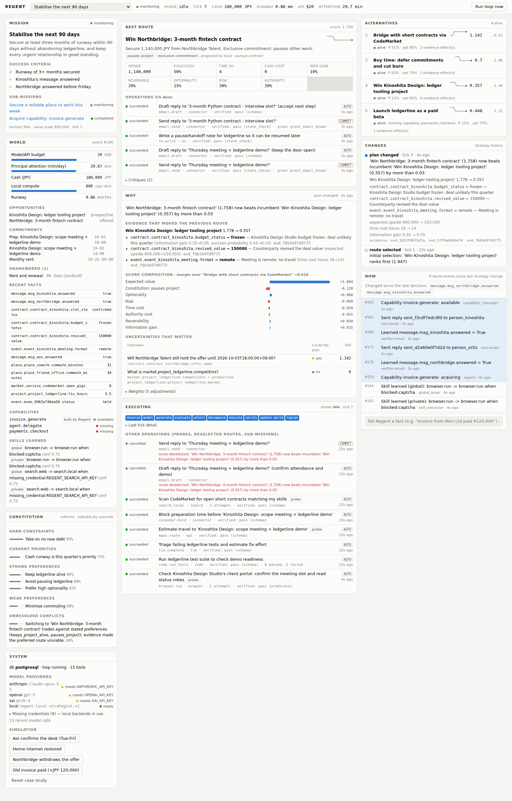

# Regent

Regent is an **operational principal**. It is not a chatbot or a workflow builder. You give it a
broad objective, your values and your permissions. From then on it keeps a model of your world,
generates competing strategies, picks one, does the machine-executable work, asks you only for
bounded real-world actions, verifies outcomes, and changes strategy when the evidence changes.

```
OBSERVE → MODEL WORLD STATE → GENERATE ROUTES → EVALUATE ROUTES → SELECT PLAN
        → DECOMPOSE → EXECUTE → VERIFY → UPDATE WORLD → FULL RE-EVALUATION → REPLAN
```

The loop is plain, explicit code in [`regent/core/loop.py`](regent/core/loop.py). No agent
framework sits in between.



## What runs today

All of this is exercised end to end by the test suite, against PostgreSQL and real Chromium.

1. **Missions** form a graph: a root objective, sub-goals you add, and sub-missions Regent spawns
   itself, such as capability acquisition. Success criteria are conditions over world facts.
2. **Events → world state.** An append-only event store drives projections: 21 entity kinds,
   typed relations, facts, resources, ledger, constitution, grants, capabilities and skills.
   State can be rebuilt from the log or from a snapshot, and any two snapshots can be diffed.
3. **Competing routes.** Every available model provider proposes routes independently. Proposals
   are merged by key, with each provider's estimates kept separately. Disagreement becomes
   explicit uncertainty; it is never averaged away as consensus.
4. **Structured evaluation, owned by Regent.** Models estimate; Regent scores. Each score is split
   into components (expected value with a concave utility, information gain, optionality,
   reversibility, time, money measured against *free* cash, risk, authority cost, constitution
   tag bonuses). Weights come from base weights × constitution × resource scarcity.
5. **Evidence-driven updates.** Routes declare *sensitivities*: "if `contract.X.budget_status` is
   `frozen`, success probability ×0.25". When a verified fact arrives, estimates move and the
   decision log records exactly which evidence moved which number.
6. **Value of information.** For every unknown fact some route depends on, Regent simulates each
   branch and asks: *could learning this flip the plan?* Probes that resolve such facts run in
   parallel, even for routes that are not selected.
7. **Selection with hysteresis.** An incumbent is replaced only when it becomes unviable or is
   beaten by a margin. Sunk cost never enters the score.
8. **Execution against real tools**: LLM, search, Playwright browser, sandboxed filesystem,
   pytest/Python execution, GitHub, email, calendar, maps, HTTP, commerce, payments,
   agent delegation, and the human. Every call is authority-checked, affordability-checked,
   concurrent, time-limited and retried, with fallback reroutes.
9. **Authority** has three levels: `AUTO`, `COMMIT` and `IDENTITY`. Standing grants carry
   constraints such as "known contacts only" or "≤ ¥3,000". Regent never asks when authority
   already exists.
10. **Human interrupts** are structured and bounded: reason, exact action, time estimate, blocking
    operation, and a machine-checkable resume condition. Regent resumes by itself when, say, the
    page stops showing a CAPTCHA.
11. **Verification**: schema, predicate, independent state check (for example, read the outbox
    back), model, or human-confirmed. Only verified results become evidence and facts.
12. **Capability acquisition.** "Cannot" is not terminal. A missing capability opens a
    sub-mission whose competing routes are the nine acquisition strategies. In the case study
    Regent *writes, tests and registers* an invoice tool, which a later route then uses.
13. **Skills.** A run of attempt → failure → reroute → success is generalized into a skill,
    stored privately and published to the global domain through a privacy filter. The executor
    reuses learned reroutes before failing again.
14. **Constitution** items are inferred from explicit statements, overrides, rejections and
    repeated choices. Each carries a Beta-distributed confidence. Items are grouped into hard
    constraints, strong and weak preferences, priorities and unresolved conflicts.
15. **Treasury.** Cash, API spend, compute and principal attention are ledgered. Scarcity
    re-weights the evaluation, and budget guards block unaffordable operations.
16. **Audit.** Each decision stores:
    - the snapshot it was made against
    - the routes considered, the selection and the reason
    - the evidence and model outputs used
    - the authority decision and the outcome
17. **Cockpit UI.** The panels are NOW, BEST ROUTE, WHY, EXECUTING, BLOCKED BY YOU,
    ALTERNATIVES, CHANGES, WORLD and MISSION, plus constitution, system and simulation controls.
    It is not a chat window.

## The case study (seeded)

You are a freelance developer with **0.86 months of runway**, one client meeting in three days,
one software project (`ledgerline`, whose test suite has two real failing tests), four unanswered
messages, and a home internet outage.

| Step | What Regent does |
|---|---|
| Ingest | Messages, meeting, contracts, places, cash, preferences and grants arrive as events. |
| Compete | Five routes for the root mission: win the Kinoshita client, take Northbridge's 3‑month exclusive contract, bridge with short gigs, launch ledgerline as a paid beta, or buy time by deferring rent. Three routes for the workplace sub-mission. |
| Choose | *Win Kinoshita* ranks first. Money pressure pushes toward Northbridge, but the principal's preferences for keeping the project alive and for optionality hold it back. |
| Work | Runs the real test suite (8 passed, 2 failed), triages the failures, estimates travel, blocks prep time on the calendar, scans the gig market, and books Aoi's free desk by replying under the standing *known contacts* grant. |
| Detect a gap | Opens a sub-mission for the missing `invoice.generate` capability, then builds, tests and registers the tool. |
| Ask once | The client portal shows a CAPTCHA. Regent raises one interrupt: *complete the human-verification challenge (~20 s)*. The reply to the client, which depends on the portal, waits. |
| Resume | You solve it in your own browser. Regent sees that the page has changed, re-runs the browser operation and reads: **budget frozen, pilot only (¥150k), meeting remote**. |
| Revise | Kinoshita drops from 1.78 to 0.36. Regent switches to Northbridge, cancels the now-pointless steps, replies to Northbridge, writes a pause note for ledgerline, tells Kinoshita the door is open for January, and records the constitution conflict it just accepted. |
| Again | Inject *Northbridge withdraws* from the cockpit: that route is invalidated and Regent switches to the gig route, which uses the tool it built earlier. |

## Run it

With Docker:

```bash
cd regent
docker compose up --build          # Postgres+pgvector, API + loop worker + Chromium, cockpit
open http://localhost:3000         # click "Load case study"
```

Without Docker (PostgreSQL reachable at `REGENT_DATABASE_URL`; SQLite also works):

```bash
cd regent
pip install -e ".[providers,browser,dev]" && python -m playwright install chromium
REGENT_BACKGROUND_LOOP=1 uvicorn apps.api.main:app --port 8000 &
cd apps/web && npm install && REGENT_API_URL=http://localhost:8000 npm run dev
```

Headless:

```bash
python -m regent.cli seed && python -m regent.cli run && python -m regent.cli status
python -m regent.cli interrupts           # then solve the portal at the printed URL
python -m regent.cli run && python -m regent.cli status
```

Tests:

```bash
pytest                              # 39 tests; PostgreSQL if reachable, else SQLite
cd apps/web && npm test && npm run typecheck
python scripts/ui_smoke.py          # real-browser run through the cockpit (servers must be up)
```

## Credentials

Regent never blocks on a missing credential. The integration interface exists, a local backend
is used instead, and the gap is listed at `GET /api/system` and in the cockpit's System panel.

| Variable | Enables | Without it |
|---|---|---|
| `ANTHROPIC_API_KEY`, `OPENAI_API_KEY`, `XAI_API_KEY` | Remote route generation, critique, drafting and code synthesis (Claude, GPT, Grok), compared side by side | Local deterministic strategist (playbooks + templates) |
| `REGENT_SEARCH_API_KEY` | Live web search (Brave) | Local index; Regent learns the reroute as a skill |
| `GITHUB_TOKEN` | GitHub API | Local git inspection |
| `REGENT_SMTP_URL`, `GOOGLE_CALENDAR_CREDENTIALS`, `GOOGLE_MAPS_API_KEY` | Real mail, calendar and maps | Persisted local mailbox, calendar and places |
| `STRIPE_API_KEY` | Payments | Capability stays *missing*; acquisition options are listed |
| `REGENT_AGENT_ENDPOINT`, `REGENT_GLOBAL_BRAIN_URL` | External agent delegation, distributed global brain | Unavailable / local global domain |

## Layout

```
apps/api/            ASGI entrypoint (FastAPI app lives in regent/api)
apps/web/            Next.js cockpit
regent/core/         observe · world · constitution · goals · routes · evaluate · planner ·
                     executor · verify · replan · capabilities · authority · human ·
                     treasury · memory · audit · loop.py
regent/models/       provider interface, Anthropic/OpenAI/xAI, local strategist, registry
regent/tools/        tool abstraction, registry, built-in tools
regent/connectors/   email, calendar, maps, search, commerce, GitHub backends
regent/browser/      Playwright driver, HTTP fallback, blocker detection
regent/global_brain/ private/shared/global domains, privacy filter, sync interface
regent/sim/          seeded case study + simulated client portal
packages/schemas/    JSON Schema for provider/tool contracts
infra/               Dockerfiles, dev script
docs/                architecture, screenshots
tests/               pytest suite
```

See [docs/ARCHITECTURE.md](docs/ARCHITECTURE.md) for the design and its current limits.
