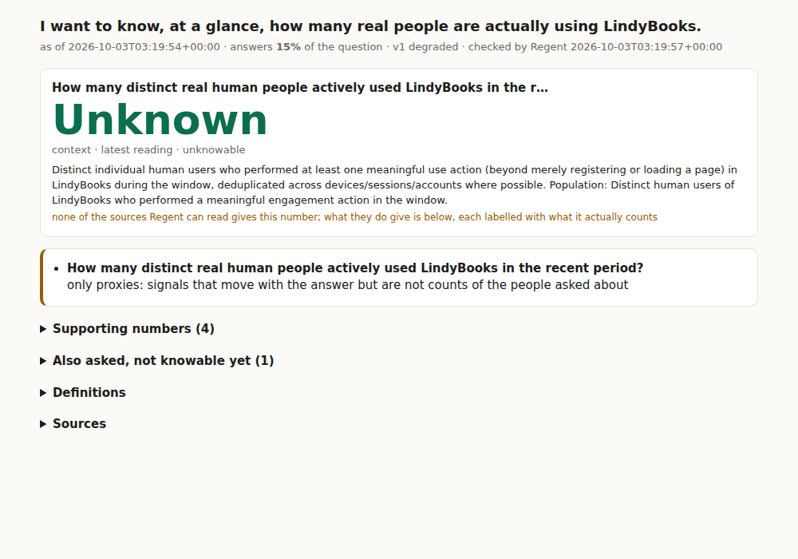
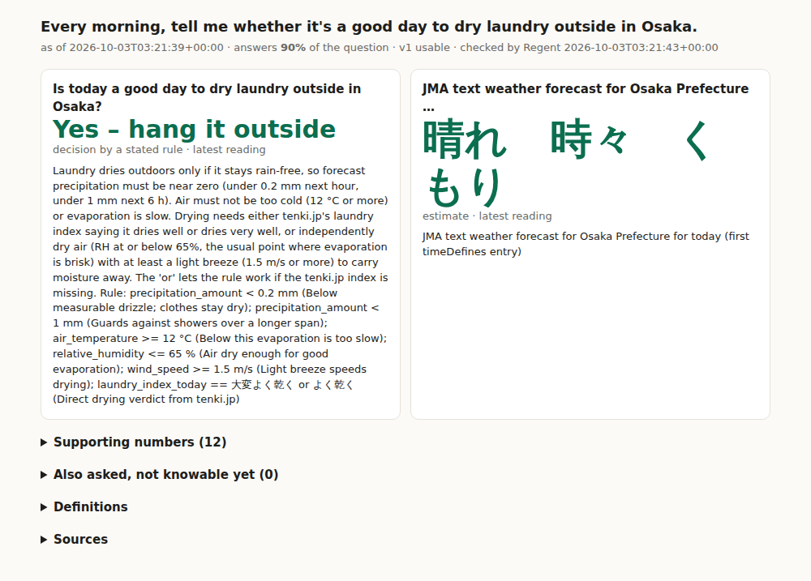

# Software needs benchmark

Run 2026-10-03T03:18:35Z, 190 s wall clock, live public web, one fresh world. Regent received only the sentences below; no provider, metric, framework, database, UI, deployment method or plan.

## Result: PASS

### LindyBooks

- [x] the subject was found on the live web from its name alone: lindy-books.org
- [x] 5 competing routes were generated and scored
- [x] the conventional route (add an analytics script) was ruled out by the product's own public promise
- [x] the capability passed Regent's own acceptance suite (14/14 checks passed)
- [x] the capability is active: degraded, tool `cap_lindybooks_active_real_users`, coverage 0.15
- [x] no number is shown for a source Regent cannot read (0 metrics honestly blocked)
- [x] every number about people is a form its audited premises earn; anything else is labelled a proxy (the headline says Unknown when only proxies exist)
- [x] no credential requested: every platform source the principal could unlock is only a proxy for the question (open interrupts: 0)
- [x] active human time so far: 22.5 s
- [x] a later mission, worded differently, reused the capability without re-examining the world
- [x] Regent re-read the capability's sources on its own (1 -> 2 observations)

### Second need (materially different)

- [x] the place was resolved: Osaka (34.694, 135.501, Asia/Tokyo)
- [x] sources were proposed and admitted only by use: 2 APIs, 1 existing-service pages; 4 rejected
- [x] a source whose robots.txt disallows Regent was rejected, not worked around
- [x] using an existing service competed with building from data
- [x] the yes/no answer is a stated rule Regent parsed and evaluated live
- [x] the view and the message lead with the yes/no verdict
- [x] acceptance suite: 18/18 checks passed
- [x] mission status: completed
- [x] the morning message was delivered: Yes – hang it outside — JMA text weather forecast for Osaka Prefecture …: 晴れ　時々　くもり — (JMA wind text forecast for Osaka Prefecture tod… 北の風　海上　では　北の風　やや強く; Hour
- [x] active human time: 22.5 s

## A. “I want to know, at a glance, how many real people are actually using LindyBooks.”

82.0 s, 4 ticks, reasoning-worker cost $0.13 (8 live calls). Final status: **monitoring**.

### What the sentence needs (need analysis, checked against the sentence)

- handled as: `software_capability`; analysed by claude-code
- subjects: LindyBooks (product)
- deliverable: {'why': "'At a glance' means a view readable in seconds that stays current, headlined by one number of real active users.", 'form': 'glance_view', 'refresh': 'continuous', 'deliver_at_local': None, 'max_seconds_to_read': 5}
- **active_real_users** (core, count): How many distinct real human people actively used LindyBooks in the recent period? — quantity: Distinct individual human users who performed at least one meaningful use action (beyond merely registering or loading a page) in LindyBooks during the window, deduplicated across devices/sessions/accounts where possible; excludes: bots, crawlers and automated traffic, internal staff, team and test accounts, duplicate accounts or devices of the same person where detectable, spam or fake sign-ups, registered but inactive accounts, one-touch bounce visits with no meaningful action; windows: 24h, 7d, 30d
- **trend_vs_prior** (supporting, amount): Is the active real-user count up or down compared to the previous equivalent period? — quantity: Change in active real users versus the prior equal-length window; excludes: same exclusions as active_real_users; windows: 7d, 30d

### What Regent found

- LindyBooks: 52 hostnames probed; deployments: lindy-books.org (aliases ['lindy-books.pages.dev'], platforms ['cloudflare'], analytics none, promises ['No ads', 'no accounts', 'no tracking', 'free forever', '追跡なし', '広告なし', '永久に無料'], 13 readable endpoints, owner evidence ["'yi525tokyo' in hostname (variant of yi525tokyo-prog)"])
- proposed sources admitted: APIs [], pages []

Fields that bear on the need (12 of 21 classified; each reading backed by a verbatim quote Regent found in what it observed):

| source | field | relation | meaning | quote found |
|---|---|---|---|---|
| connector:cloudflare_analytics | uniques_last_full_day | proxy | distinct client IPs on the last complete UTC day, including crawlers and bots | True |
| connector:cloudflare_analytics | uniques_7d_daily_max | proxy | highest daily distinct-IP count in the last 7 complete days. It is not a 7-day distinct co | True |
| connector:cloudflare_analytics | page_views_last_full_day | proxy | HTML page views on the last complete UTC day | True |
| connector:cloudflare_analytics | page_views_7d | proxy | HTML page views over the last 7 complete days | True |
| connector:cloudflare_analytics | daily | proxy | per-day rows of edge requests, page views and unique IPs, usable for week-over-week trend  | True |
| connector:stripe_payments | paying_people | proxy | distinct paying customers, all time | True |
| connector:stripe_payments | successful_charges | proxy | paid, unrefunded charges | True |
| connector:google_search_console | clicks_28d | proxy | clicks from Google search to the site over 28 days | True |
| https://lindy-api.yi525tokyo.workers.dev/api/fund | paid.count | proxy | number of payments received, as shown in the fund display | True |
| https://lindy-api.yi525tokyo.workers.dev/api/fund | recent.0.t | context | epoch ms timestamp of a recent payment event | True |
| https://lindy-api.yi525tokyo.workers.dev/api/fund | today.prose | context | daily usage counter against the prose cap, probably translation units used today. It is 0  | True |
| https://lindy-api.yi525tokyo.workers.dev/api/fund | today.meta | context | daily usage counter against the meta cap, probably metadata translation units used today.  | True |

Ruled out as unrelated: `impressions_28d` (search result impressions over 28 days); `total` (catalogue size of books); `sealed` (number of books sealed or translated in the fund); `poolLeft` (remaining pool budget); `caps.prose` (daily cap); `books.0.dl` (upstream Project Gutenberg download count for a book, not Li); `corpus` (catalogue size); `total` (catalogue list size); `sealed` (number of sealed books)
- commitment: No ads, so ad-based measurement is not allowed. — quote “No ads” found: True
- commitment: No accounts, so measurement cannot rely on logins or registrations. — quote “no accounts” found: True
- commitment: No tracking, so third-party analytics, client trackers and stored personal identifiers are not allowed. — quote “no tracking” found: True

### Routes

| rank | route | status | score | P(success) | upside | authority | why not / note |
|---|---|---|---|---|---|---|---|
| 1 | Compose a live answer from what lindy-books.org already publishes | selected | 0.551 | 0.89 | 0.15 | 0.00 |  |
| 2 | Change the product to count its own readers first-party | alive | 0.388 | 0.35 | 0.95 | 0.85 |  |
| 3 | Have a coding agent build a bespoke usage application on the same sources | alive | 0.388 | 0.60 | 0.15 | 0.40 |  |
| 4 | Look it up yourself on the Cloudflare zone analytics dashboard | alive | 0.295 | 0.88 | 0.07 | 0.90 |  |
| 5 | Add a client-side analytics script to the product | invalidated | 0.652 | 0.70 | 0.85 | 0.70 | lindy-books.org publicly promises: "no tracking" -- nothing may add tracking to it (route tagged 'third_party_tracking:lindy-books.org') |

Selected: **software-compose-public**

### Loop

- tick 1 (+79.2s, active): acquire ['acquire.analyze.1', 'acquire.discover.1', 'acquire.inventory.1']; select software-compose-public (route_selected); executed 1; verified [('acquire.analyze.1', 'pass'), ('acquire.discover.1', 'pass'), ('acquire.inventory.1', 'pass'), ('sw.compose', 'pass')]
- tick 2 (+81.8s, active): acquire []; select software-compose-public (plan_kept); executed 1; verified [('sw.verify', 'pass')]
- tick 3 (+82.0s, monitoring): acquire []; select software-compose-public (plan_kept); executed 1; verified [('sw.activate', 'pass')]
- tick 4 (+82.0s, monitoring): acquire []; select None (None); executed None; verified []

### Operations

| op | tool | authority | status | note |
|---|---|---|---|---|
| acquire.analyze.1 | acquire.analyze | AUTO | succeeded |  |
| acquire.discover.1 | acquire.discover | AUTO | succeeded |  |
| acquire.inventory.1 | acquire.inventory | AUTO | succeeded |  |
| sw.compose | software.compose | AUTO | succeeded |  |
| sw.verify | software.verify | AUTO | succeeded |  |
| sw.activate | software.activate | AUTO | succeeded |  |

### Capability `lindybooks-active-real-users` v1 (composed, degraded)

Tool `cap_lindybooks_active_real_users`; view `/software/lindybooks-active-real-users`; JSON `/api/software/capabilities/lindybooks-active-real-users`. Sources: lindy_api_fund (http_json, public)

Acceptance suite (Regent's own; nothing taken on a worker's word):

- [x] metrics are well-formed — 5 metrics
- [x] every number about the people asked about is a form its premises earn — bounds rest on audited premises; everything else is labelled a proxy
- [x] a headline exists — 
- [x] every core question is answered or marked unknowable-yet — 1 core question(s) accounted for
- [x] the capability answers at least one question with a number — 
- [x] source lindy_api_fund answers with every declared field — 4 fields
- [x] independent read of lindy_api_fund agrees — every field matches a direct read
- [x] no number is shown for a blocked source — 0 metric(s) honestly blocked
- [x] counts are non-negative — 
- [x] lower bounds do not exceed upper bounds — 
- [x] stored observations contain no identifying data — aggregates only
- [x] sources are read-only and add nothing to the product — every source is a read of something that already exists
- [x] the registered tool returns the computed answer — 5 metrics via cap_lindybooks_active_real_users.read
- [x] the glance view shows exactly the computed numbers — 5 numbers match (rendered in headless Chromium)

What it shows now:

| metric | shows | form | status | definition |
|---|---|---|---|---|
| How many distinct real human people actively used LindyBooks in the r… (headline) | Unknown | context | unknowable | Distinct individual human users who performed at least one meaningful use action (beyond merely registering or loading a page) in LindyBooks during the window, deduplicated across devices/sessions/accounts where possible |
| Proxy: number of payments received, as shown i… | 2 | proxy | ok | number of payments received, as shown in the fund display. A signal that may move with the answer; no number of people follows from it. Missing: membership, distinctness, window. |
| epoch ms timestamp of a recent payment event | 2026-08-01 01:40 UTC | context | ok | epoch ms timestamp of a recent payment event |
| daily usage counter against the prose cap, prob… (last 24h) | 0 | context | partial | Increase of the daily counter today.prose over the last 24 hours (resets counted): daily usage counter against the prose cap, probably translation units used today. It is 0 in the sample. |
| daily usage counter against the meta cap, proba… (last 24h) | 0 | context | partial | Increase of the daily counter today.meta over the last 24 hours (resets counted): daily usage counter against the meta cap, probably metadata translation units used today. It is 0 in the sample. |

Not knowable yet:

- How many distinct real human people actively used LindyBooks in the recent period?: only proxies: signals that move with the answer but are not counts of the people asked about
- Is the active real-user count up or down compared to the previous equivalent period?: no source Regent can read answers this → unlock: Create a Cloudflare API token (dash.cloudflare.com → My Profile → API Tokens → Create Token → 'Read analytics and logs' template, zone lindy-books.org) and paste it here (~180 s)

### Human

- active human time spent: **22.5 s**; requested and still open: 0.0 s (statement typing at 40 wpm + interrupts (measured when reported, else Regent's estimate))

## D. “Every morning, tell me whether it's a good day to dry laundry outside in Osaka.”

93.9 s, 4 ticks, reasoning-worker cost $0.272 (13 live calls). Final status: **completed**.

### What the sentence needs (need analysis, checked against the sentence)

- handled as: `software_capability`; analysed by claude-code
- subjects: Osaka (place)
- deliverable: {'why': "'Every morning, tell me' implies a recurring short daily message with a verdict. Time of day not specified, so a morning default is used.", 'form': 'report', 'refresh': 'daily', 'deliver_at_local': '07:00', 'max_seconds_to_read': 10}
- **good_day_outdoor_laundry_drying** (core, yes_no): Is today a good day to dry laundry outside in Osaka? — quantity: Verdict (yes/no) on whether today's daytime weather in Osaka favors outdoor line-drying: no rain or precipitation expected during drying hours, plus supportive conditions (low humidity, some wind/sun, comfortable temperature). Verdict is based on forecast for today's daylight drying hours.; excludes: yesterday's or past weather, forecasts for other days, other cities or prefectures, indoor drying conditions; windows: today daytime (08:00-18:00 local)
- **drying_conditions_detail** (supporting, list): What are the key conditions behind the verdict (rain chance, humidity, wind, temperature, and any pollen/PM2.5/yellow-dust warnings)? — quantity: Today's forecast precipitation probability (%), relative humidity (%), wind speed, temperature (°C), and air-quality/pollen alerts for Osaka during drying hours; excludes: other days; windows: today daytime (08:00-18:00 local)

### What Regent found

- Osaka: place {'name': 'Osaka', 'admin1': 'Osaka', 'country': 'Japan', 'latitude': 34.69379, 'timezone': 'Asia/Tokyo', 'elevation': 4.0, 'longitude': 135.50107, 'population': 2753862, 'country_code': 'JP'}
- proposed sources admitted: APIs ['https://www.jma.go.jp/bosai/forecast/data/forecast/270000.json', 'https://api.met.no/weatherapi/locationforecast/2.0/compact?lat=34.694&lon=135.501'], pages ['tenki.jp Osaka City 3-hourly forecast']
  - rejected https://api.open-meteo.com/v1/forecast?latitude=34.69379&longitude=135.50107&hourly=temperature_2m,relative_hu: did not answer: 0 {'type': 'robots', 'detail': 'disallowed by robots.txt'}
  - rejected https://air-quality-api.open-meteo.com/v1/air-quality?latitude=34.69379&longitude=135.50107&hourly=pm2_5,pm10,: did not answer: 0 {'type': 'robots', 'detail': 'disallowed by robots.txt'}
  - rejected https://tenki.jp/forecast_accuracy/: Direct laundry-drying index (洗濯指数) for Osaka city
  - rejected https://tenki.jp/forecast_accuracy/: Direct laundry-drying index for Osaka city today

Fields that bear on the need (13 of 17 classified; each reading backed by a verbatim quote Regent found in what it observed):

| source | field | relation | meaning | quote found |
|---|---|---|---|---|
| jma.go.jp/bosai/forecast/data/forecast/270000.json | 0.timeSeries.0.areas.0.weathers.0 | direct | JMA text weather forecast for Osaka Prefecture for today (first timeDefines entry) | True |
| jma.go.jp/bosai/forecast/data/forecast/270000.json | 0.timeSeries.0.areas.0.winds.0 | context | JMA wind text forecast for Osaka Prefecture today (prefecture-wide, qualitative) | True |
| ocationforecast/2.0/compact?lat=34.694&lon=135.501 | imeseries.0.data.instant.details.relative_humidity | direct | Hourly forecast relative humidity (%) at Osaka coordinates; one entry per hour (UTC), pick | True |
| ocationforecast/2.0/compact?lat=34.694&lon=135.501 | rties.timeseries.0.data.instant.details.wind_speed | direct | Hourly forecast wind speed (m/s) at Osaka coordinates | True |
| ocationforecast/2.0/compact?lat=34.694&lon=135.501 | .timeseries.0.data.instant.details.air_temperature | direct | Hourly forecast air temperature (°C) at Osaka coordinates | True |
| ocationforecast/2.0/compact?lat=34.694&lon=135.501 | eseries.0.data.instant.details.cloud_area_fraction | context | Hourly forecast cloud cover (%), proxy for sunshine | True |
| ocationforecast/2.0/compact?lat=34.694&lon=135.501 | s.0.data.next_1_hours.details.precipitation_amount | direct | Forecast precipitation amount (mm) in the following hour; sum over 08-18 JST hours to dete | True |
| ocationforecast/2.0/compact?lat=34.694&lon=135.501 | s.0.data.next_6_hours.details.precipitation_amount | context | Forecast precipitation (mm) over next 6 hours; overlaps with hourly values | True |
| ps://tenki.jp/forecast/6/30/6200/27100/3hours.html | laundry_index_today | direct | tenki.jp laundry drying index label for today (大変よく乾く = dries very well) | True |
| ps://tenki.jp/forecast/6/30/6200/27100/3hours.html | rain_probability_today | direct | Today's 3-hourly precipitation probability (%) for 03,06,...,24h; --- means past | True |
| ps://tenki.jp/forecast/6/30/6200/27100/3hours.html | humidity_today | direct | Today's 3-hourly humidity (%) | True |
| ps://tenki.jp/forecast/6/30/6200/27100/3hours.html | wind_speed_today | direct | Today's 3-hourly wind speed (m/s) | True |
| ps://tenki.jp/forecast/6/30/6200/27100/3hours.html | temperature_today | direct | Today's 3-hourly temperature (°C), first number is a stray label | True |

Ruled out as unrelated: `0.timeSeries.1.areas.0.pops.0` (Probability of precipitation (%) for Osaka Prefecture for th); `0.timeSeries.1.areas.0.pops.1` (Probability of precipitation (%) for 6-hour block starting 1); `0.timeSeries.2.areas.0.temps.0` (Forecast temperature (°C) for Osaka city; today's daytime ma); `properties.timeseries.0.data.instant.details.air_pressure_at_sea_level` (Sea-level pressure (hPa); not relevant to drying)
- decision rule `latest("met_2_0_compact:properties.timeseries.0.data.next_1_hours.details.precipitation_amount") < 0.2 and latest("met_2_0_compact:properties.timeseries.0.data.next_6_hours.details.precipitation_amount") < 1 and latest("met_2_0_compact:properties.timeseries.0.data.instant.details.air_temperature") >` -> True now

### Routes

| rank | route | status | score | P(success) | upside | authority | why not / note |
|---|---|---|---|---|---|---|---|
| 1 | Build from public data and cross-check against tenki.jp Osaka City 3-hourly forecast | selected | 1.272 | 0.92 | 0.90 | 0.00 |  |
| 2 | Build the answer from public data with a stated rule | alive | 1.200 | 0.86 | 0.90 | 0.00 |  |
| 3 | Use what tenki.jp Osaka City 3-hourly forecast already shows people | alive | 1.092 | 0.83 | 0.90 | 0.00 |  |
| 4 | Have a coding agent build a bespoke usage application on the same sources | alive | 0.838 | 0.60 | 0.90 | 0.40 |  |

Selected: **software-compose-crosscheck**

### Loop

- tick 1 (+88.3s, active): acquire ['acquire.analyze.1', 'acquire.discover.1', 'acquire.inventory.1']; select software-compose-crosscheck (route_selected); executed 1; verified [('acquire.inventory.1', 'pass'), ('sw.compose', 'pass'), ('acquire.analyze.1', 'pass'), ('acquire.discover.1', 'pass')]
- tick 2 (+93.7s, active): acquire []; select software-compose-crosscheck (plan_kept); executed 1; verified [('sw.verify', 'pass')]
- tick 3 (+93.9s, completed): acquire []; select software-compose-crosscheck (plan_kept); executed 1; verified [('sw.activate', 'pass')]
- tick 4 (+93.9s, completed): acquire []; select None (None); executed None; verified []

### Operations

| op | tool | authority | status | note |
|---|---|---|---|---|
| acquire.analyze.1 | acquire.analyze | AUTO | succeeded |  |
| acquire.discover.1 | acquire.discover | AUTO | succeeded |  |
| acquire.inventory.1 | acquire.inventory | AUTO | succeeded |  |
| sw.compose | software.compose | AUTO | succeeded |  |
| sw.verify | software.verify | AUTO | succeeded |  |
| sw.activate | software.activate | AUTO | succeeded |  |

### Capability `osaka-good-day-outdoor-laundry-drying` v1 (composed, usable)

Tool `cap_osaka_good_day_outdoor_laundry_drying`; view `/software/osaka-good-day-outdoor-laundry-drying`; JSON `/api/software/capabilities/osaka-good-day-outdoor-laundry-drying`. Sources: jma_forecast_270000_json (http_json, public); met_2_0_compact (http_json, public); tenki_27100_3hours_html (html_page, public)

Acceptance suite (Regent's own; nothing taken on a worker's word):

- [x] metrics are well-formed — 14 metrics
- [x] every number about the people asked about is a form its premises earn — bounds rest on audited premises; everything else is labelled a proxy
- [x] a headline exists — 
- [x] every core question is answered or marked unknowable-yet — 1 core question(s) accounted for
- [x] the capability answers at least one question with a number — 
- [x] source jma_forecast_270000_json answers with every declared field — 2 fields
- [x] independent read of jma_forecast_270000_json agrees — every field matches a direct read
- [x] source met_2_0_compact answers with every declared field — 6 fields
- [x] independent read of met_2_0_compact agrees — every field matches a direct read
- [x] source tenki_27100_3hours_html answers with every declared field — 5 fields
- [x] independent read of tenki_27100_3hours_html agrees — every field matches a direct read
- [x] no number is shown for a blocked source — 0 metric(s) honestly blocked
- [x] counts are non-negative — 
- [x] lower bounds do not exceed upper bounds — 
- [x] stored observations contain no identifying data — aggregates only
- [x] sources are read-only and add nothing to the product — every source is a read of something that already exists
- [x] the registered tool returns the computed answer — 14 metrics via cap_osaka_good_day_outdoor_laundry_drying.read
- [x] the glance view shows exactly the computed numbers — 14 numbers match (rendered in headless Chromium)

What it shows now:

| metric | shows | form | status | definition |
|---|---|---|---|---|
| JMA text weather forecast for Osaka Prefecture … (headline) | 晴れ　時々　くもり | estimate | ok | JMA text weather forecast for Osaka Prefecture for today (first timeDefines entry) |
| JMA wind text forecast for Osaka Prefecture tod… | 北の風　海上　では　北の風　やや強く | context | ok | JMA wind text forecast for Osaka Prefecture today (prefecture-wide, qualitative) |
| Hourly forecast relative humidity (%) at Osaka … | 48.2 | estimate | ok | Hourly forecast relative humidity (%) at Osaka coordinates; one entry per hour (UTC), pick 23:00Z-09:00Z for 08-18 JST |
| Hourly forecast wind speed (m/s) at Osaka coord… | 3.6 | estimate | ok | Hourly forecast wind speed (m/s) at Osaka coordinates |
| Hourly forecast air temperature (°C) at Osaka c… | 23.6 | estimate | ok | Hourly forecast air temperature (°C) at Osaka coordinates |
| Hourly forecast cloud cover (%), proxy for suns… | 0.8 | context | ok | Hourly forecast cloud cover (%), proxy for sunshine |
| Forecast precipitation amount (mm) in the follo… | 0 | estimate | ok | Forecast precipitation amount (mm) in the following hour; sum over 08-18 JST hours to determine rain |
| Forecast precipitation (mm) over next 6 hours | 0 | context | ok | Forecast precipitation (mm) over next 6 hours; overlaps with hourly values |
| tenki.jp laundry drying index label for today (… (tenki.jp) | 大変よく乾く | estimate | ok | tenki.jp laundry drying index label for today (大変よく乾く = dries very well) |
| Today's 3-hourly precipitation probability (%) … (tenki.jp) | --- --- --- --- 0 0 20 30 | estimate | ok | Today's 3-hourly precipitation probability (%) for 03,06,...,24h; --- means past |
| Today's 3-hourly humidity (%) (tenki.jp) | 79 85 66 44 41 54 63 66 | estimate | ok | Today's 3-hourly humidity (%) |
| Today's 3-hourly wind speed (m/s) (tenki.jp) | 1 0 1 3 3 3 3 3 | estimate | ok | Today's 3-hourly wind speed (m/s) |
| Today's 3-hourly temperature (°C), first number… (tenki.jp) | 4 17.0 15.9 20.5 24.6 25.9 21.9 20.0 19.2 | estimate | ok | Today's 3-hourly temperature (°C), first number is a stray label |
| Is today a good day to dry laundry outside in Osaka? (headline) | Yes – hang it outside | decision | ok | Laundry dries outdoors only if it stays rain-free, so forecast precipitation must be near zero (under 0.2 mm next hour, under 1 mm next 6 h). Air must not be too cold (12 °C or more) or evaporation is slow. Drying needs  |

### Human

- active human time spent: **22.5 s**; requested and still open: 0.0 s (statement typing at 40 wpm + interrupts (measured when reported, else Regent's estimate))

## B. Reuse: “How many people actually read LindyBooks these days?”

Status monitoring in 11.5 s. Need-analysis reuse match: [('lindybooks-active-real-users', 'claude-code', ['active_readers_recent', 'reader_trend'])]

| rank | route | status | score | P(success) | upside | authority | why not / note |
|---|---|---|---|---|---|---|---|
| 1 | Use the existing capability 'LindyBooks: How many distinct real human people actively used LindyBooks in the recent period?' | selected | 0.675 | 0.94 | 0.30 | 0.00 |  |

Operations: acquire.analyze.1 (succeeded), sw.reuse (succeeded)

## C. Regent keeps using what it built

After the refresh period, maintenance re-read the sources: ['lindybooks-active-real-users: done']; observations 1 -> 2 (the clock was advanced one hour for the refresh check only; the reads were live).

## E. Delivery

- 2026-10-03 via regent_inbox: Yes – hang it outside — JMA text weather forecast for Osaka Prefecture …: 晴れ　時々　くもり — (JMA wind text forecast for Osaka Prefecture tod… 北の風　海上　では　北の風　やや強く; Hourly forecast relative humidity (%) at Osaka … 48.2; Hourly forecast wind speed (m/s) at Osaka coord… 3.6)

## Delegatable resources at run time

| resource | available | note |
|---|---|---|
| reasoner | True | Claude Code CLI, headless and tool-less; answers are claims Regent checks |
| coding_agent | False | the principal has not opted in to autonomous coding agents (set REGENT_CODING_AGENT=claude-code); each run also needs an approved operation |
| http | True | read-only, robots.txt respected, honest user agent |
| browser | True | renders pages; stops at CAPTCHAs and logins (human interrupt) |
| human | True | identity, credentials, payment approval, irreversible commitments only |
| connector:cloudflare_analytics | False | read-only, server-side: Cloudflare already records this as the product's host; nothing changes for the product or its readers |
| connector:stripe_payments | False | read-only, server-side; identities are hashed in memory and never stored |
| connector:google_search_console | False | read-only; the site is already verified with Google |
| connector:plausible | False | read-only; script already present |
| connector:client_side_analytics | False | adds third-party code to every page the product serves and sends each visit to a third party |
